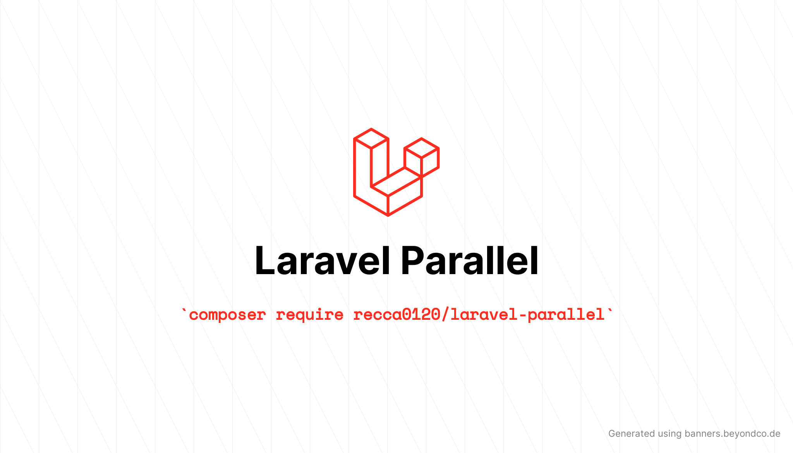

# Laravel Parallel

[](https://packagist.org/packages/recca0120/laravel-parallel)

[](https://packagist.org/packages/recca0120/laravel-parallel)



## Requirements

- **Laravel** versions 5.7, 6.x, 7.x, 8.x, 9.x, 10.x and 11.x
- **PHP** 7.0 or greater

## Installation

Install the package with composer:

```bash
composer require recca0120/laravel-parallel
```

## Usage

- make a product migration

```php
<?php

use Illuminate\Database\Migrations\Migration;
use Illuminate\Database\Schema\Blueprint;
use Illuminate\Support\Facades\Schema;

class CreateProductsTable extends Migration
{
    /**
     * Run the migrations.
     *
     * @return void
     */
    public function up()
    {
        Schema::create('products', function (Blueprint $table) {
            $table->id();
            $table->string('name');
            $table->integer('quantity')->default(0);
            $table->timestamps();
        });
    }

    /**
     * Reverse the migrations.
     *
     * @return void
     */
    public function down()
    {
        Schema::dropIfExists('products');
    }
}


```

- define product model `App\Models\Product`

```php
<?php

namespace App\Models;

use Illuminate\Database\Eloquent\Builder;
use Illuminate\Database\Eloquent\Factories\HasFactory;
use Illuminate\Database\Eloquent\Model;

/**
 * Class Product.
 * @property int id
 * @property string name
 * @property int quantity
 * @package App\Models
 * @mixin Builder
 */
class Product extends Model
{
    use HasFactory;

    protected $fillable = ['name', 'quantity'];

    protected $casts = ['quantity' => 'int'];
}

```

- define router in `routes/web.php`

```php
<?php

use App\Models\Product;
use Illuminate\Support\Facades\Route;

Route::get('/product/{productId}', function ($productId) {
    return Product::findOrFail($productId);
});

Route::post('/product/{productId}', function ($productId) {
    $product = Product::findOrFail($productId);
    if ($product->quantity > 0) {
        // wrong, it will make test fail
        // $product->fill(['quantity' => $product->quantity - 1])->save();

        // correct
        $product->where('id', $product->id)
            ->where('quantity', '>', 0)
            ->update(['quantity' => DB::raw('quantity - 1')]);
    }

    return $product->fresh();
});

```

- testing

```php
<?php

namespace Tests\Feature;

use App\Models\Product;
use Illuminate\Foundation\Testing\DatabaseMigrations;
use Recca0120\LaravelParallel\Tests\Concerns\WithParallelPhyiscalDatabase;
use Recca0120\LaravelParallel\Tests\ParallelRequest;
use Tests\TestCase;

class RaceConditionTest extends TestCase
{
    use DatabaseMigrations;
    use WithParallelPhyiscalDatabase;

    private $product;
    private $quantity = 10;

    public function test_race_condition()
    {
        $this->useParallelPhyiscalDatabase();

        $this->product = Product::create(['name' => 'test', 'quantity' => $this->quantity]);
        $request = $this->app->make(ParallelRequest::class);

        $promises = collect();
        for ($i = 0; $i < $this->quantity; $i++) {
            // you will get \GuzzleHttp\Promise\PromiseInterface
            $promise = $request->post('/product/'.$this->product->id);
            $promises->add($promise);
        }
        // you need wait response
        $promises->map->wait()->each->assertOk();

        $this->get('/product/'.$this->product->id)
            ->assertOk()
            ->assertJsonPath('quantity', 0);
    }

    public function test_multiple_times_to_test_race_condition()
    {
        $this->useParallelPhyiscalDatabase();

        $this->product = Product::create(['name' => 'test', 'quantity' => $this->quantity]);

        $request = $this->app->make(ParallelRequest::class);

        $promises = collect($request->times(10)->post('/product/'.$this->product->id));

        // you need wait response
        $promises->map->wait()->each->assertOk();

        $this->get('/product/'.$this->product->id)
            ->assertOk()
            ->assertJsonPath('quantity', 0);
    }
}
```

## License

The MIT License (MIT). Please see [License File](LICENSE) for more information.
